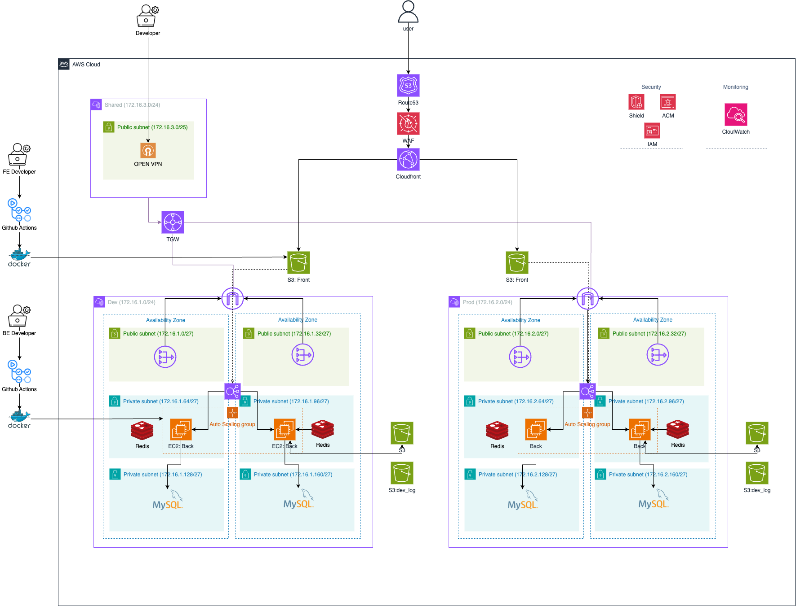

# ☁️ Zero Architecture with Terraform

Terraform을 활용하여 AWS 인프라를 코드로 구축하는 프로젝트입니다.
Dev/Prod/Shared 환경을 분리하고, 모듈화된 구조를 통해 재사용성과 유지보수성을 향상시키는 것을 목표로 하고 있습니다.

<br/>

### 📌 프로젝트 개요

이 프로젝트는 아래와 같은 목표를 기반으로 설계되었습니다.

- 인프라를 Terraform 코드로 관리

- Dev/Prod 환경을 분리하여 안정성과 확장성 확보

- Auto Scaling, Multi-AZ 배포, 보안 모듈을 포함한 실전형 아키텍처 구성

- 향후 Transit Gateway로 VPC 간 통신 관리 및 OpenVPN 접근 제어

<br/>


## 🏗️ 아키텍처 개요


### 🔹 주요 구성 요소

| 영역 | 설명 |
| --- | --- |
| **VPC 구성** | Dev, Prod, Shared VPC 구성 |
| **서브넷** | Public / Private 서브넷을 AZ별로 분리 구성 (Multi-AZ) |
| **컴퓨팅** | EC2 (백엔드) 인스턴스는 Auto Scaling Group으로 관리 |
| **DB** | MySQL RDS (Private Subnet 내부에 배치) |
| **캐시** | Redis는 EC2 또는 ElastiCache로 구성 |
| **보안** | ACM, IAM, WAF, Shield 사용 |
| **배포** | Github Actions + Docker를 활용한 CI/CD 구성 |
| **접속 제어** | OpenVPN 서버를 통해 개발자 접근 제어 (현재는 Dev VPC 내부에 위치 → 향후 Shared VPC로 분리 예정) |
| **VPC 피어링/Transit Gateway** | VPC 간 통신을 위해 TGW 구성 |

<br/>

## ✅ 현재 구현 현황

- ✅ **Dev VPC 구성 완료**
    - Public / Private 서브넷 (AZ 2개)
    - EC2 + Redis + MySQL 인스턴스 배치
    - Auto Scaling Group 설정 완료
- ✅ OpenVPN 서버 EC2 인스턴스 설정 (현재 Dev VPC 내부에서 테스트 중)
- ✅ 모듈화 구조 도입 (`modules/vpc`, `modules/ec2`, `modules/security_group` 등)
- ✅ Terraform 백엔드 설정 (S3 + DynamoDB)
- ✅ GitHub Actions를 통한 CI/CD 파이프라인 구축 중

<br/>

## 🧭 향후 계획

- [ ]  OpenVPN 인스턴스를 Shared VPC로 분리
- [ ]  Transit Gateway 설정을 통해 VPC 간 통신 구성
- [ ]  Prod 환경 인프라 배포
- [ ]  CloudFront + S3 정적 웹사이트 배포 구조 개선
- [ ]  CloudWatch를 통한 로그/모니터링 체계 구축
- [ ]  Route53을 통한 도메인 연결 및 HTTPS 설정 자동화

<br/>

## 🚀 Local 사용 방법

1. `terraform init`으로 모듈 및 백엔드 초기화
2. `terraform plan`으로 변경 사항 미리 보기
3. `terraform apply`로 인프라 생성

```bash
cd terraform_stage
terraform init
terraform plan
terraform apply
```

<br/>

## 🛠️ 전제 조건

- Terraform CLI 설치
- AWS CLI 및 자격 증명 설정
- 퍼블릭 도메인(Route53) 및 ACM 인증서 (HTTPS용)
- SSH 키페어 준비

<br/>

## ⚙️ CI/CD with GitHub Actions

 **GitHub Actions**를 활용해 Terraform 인프라를 자동으로 배포 및 제거할 수 있도록 구성되어 있습니다.

| 기능 | 설명 |
| --- | --- |
| **환경별 배포** | `stage` 입력값에 따라 `dev` 또는 `prod` 환경에 배포 가능 |
| **자동화된 배포** | GitHub Actions를 통해 Terraform `init`, `plan`, `apply` 자동 실행 |
| **인프라 삭제 지원** | `destroy: true` 입력 시 해당 환경의 인프라 자동 삭제 |

<br/>

## 🌐 도메인 접속 정보

| 도메인 | 설명 |
| --- | --- |
| [`https://seoyoungstudy.shop`](https://seoyoungstudy.shop/) | **운영 환경 (Prod)** 접속 도메인 |
| [`https://dev.seoyoungstudy.shop`](https://dev.seoyoungstudy.shop/) | **개발 환경 (Dev)** 접속 도메인 |
- 두 도메인 모두 **HTTPS**가 적용되어 있으며, ACM을 통해 인증서가 관리됩니다.
- ALB와 연결된 Route 53 레코드를 통해 환경별 트래픽이 각각의 VPC로 전달됩니다.

<br/>

## 📂 프로젝트 구조

```bash
my_architecture_terraform/
├── backend/                 # Terraform backend 설정 (S3 + DynamoDB)
├── environments/            # dev.tfvars, prod.tfvars 등 환경별 변수 파일
├── modules/                 # 재사용 가능한 VPC, EC2, SG 등 모듈
├── terraform_stage/         # dev 환경용 실제 실행 파일들
└── .github/workflows/       # GitHub Actions 설정

```